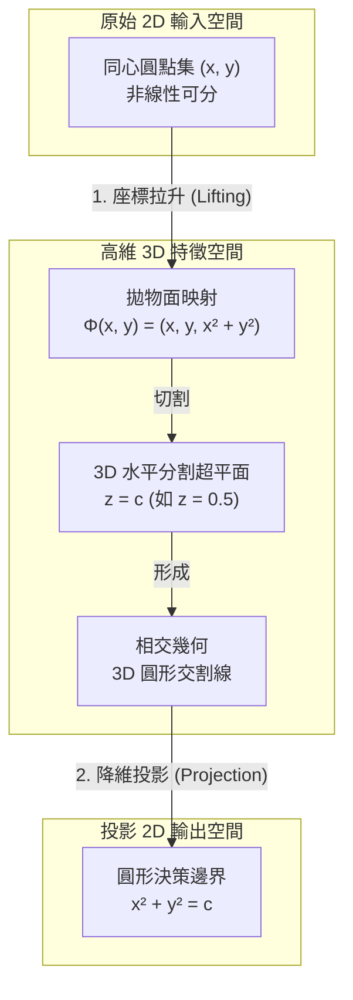

# ⚛️ SVM 核心技巧 (Kernel Trick) 3D 互動展示系統

本專案是一個兼具學術教育意義與精美互動美學的統計機器學習教學展示平台。旨在以直觀且動態的 3D 視覺化手段，向學生與機器學習開發者解說 **支援向量機 (SVM) 核心技巧 (Kernel Trick)** 的幾何與數學原理，探討如何將二維空間中非線性可分的「同心圓資料集」，映射至高維特徵空間中達成完美線性切割。

🔗 [**Live Demo**](https://huggingface.co/spaces/dec591nyc/SVM-Kernel-Trick-3D-Interactive-Display) *(請替換為您的部署網址)*

---

## 專案 Infography

| 面向 | 內容 |
| --- | --- |
| **專案定位** | 機器學習高維特徵映射、非線性決策邊界幾何幾何直觀與 3D 互動教學 |
| **數學核心** | 顯式 3D 拋物面投影映射、徑向基底函數 (RBF) 核心與希爾伯特無限維空間概念 |
| **動畫與渲染** | Manim CE 數學動態運鏡、Plotly 瀏覽器端 3D 資料拉升與 RBF 地形變形過渡動畫 |
| **前端框架** | Streamlit 互動參數控制台、精緻進階 CSS 樣式美化系統 |
| **部署方式** | Streamlit Community Cloud / Hugging Face Spaces (Streamlit SDK) |

---

## 空間對射與幾何切割流程

本系統展示了資料點從二維非線性分布，經由升維變換，在三維空間中被超平面線性分割，最後投影回二維形成圓形決策邊界的完整數學軌跡：



---

## 核心功能

1. **2D 投影平面檢視**：實時繪製 2D 分類決策邊界（黃色實線）與間距限制（灰色虛線 $f(x, y) = \pm 1$），高亮黃金環標記支援向量。採用鎖定坐標軸範圍 `[-2.2, 2.2]`，防止拖曳參數時版面發生位移。
2. **3D 拋物面拉升動畫 (Plotly)**：利用瀏覽器端 Plotly 引擎，實現將 2D 同心圓資料點沿 $Z$ 軸平滑拉升至三維拋物面 $z = x^2 + y^2$ 的動態過渡動畫，並展示半透明黃色超平面切分兩種類別的幾何效果。
3. **RBF 信心地形圖變形動畫 (Plotly)**：展示真實的 RBF 核心 SVM 決策信賴度地形圖。Z 軸代表決策信賴度 $z = f(x_1, x_2)$，支援將扁平 2D 空間平滑扭曲成三維山峰與山谷地形的動態 Morphing 動畫。
4. **Manim 概念教學動畫**：內嵌由 Manim Community Edition 引擎預先渲染的精美日系星空與櫻花粒子風格數學動畫影片，提供電影級的鏡頭旋轉與軌跡投影示範。
5. **雙主題色調切換**：支援在「經典藍紅 (Modern Blue/Red)」與「櫻花晴空 (Manim Sakura/Sky)」雙色系主題間一鍵切換，確保視覺體驗高度精緻。

---

## 本機執行

### 1. 安裝相依套件
本機需要安裝 Python 3.8+。建議使用虛擬環境：

```bash
# 建立並啟用虛擬環境
python -m venv venv
# Windows
.\venv\Scripts\activate
# macOS/Linux
source venv/bin/activate

# 安裝網頁執行必需套件
pip install -r requirements.txt
```

*(註：若您需要在本地渲染 Phase 1 的 Manim 影片，則需要另外安裝底層系統依賴如 FFmpeg，並執行 `pip install manim matplotlib`。若僅運行 Streamlit 網頁，則無需安裝這些重型套件。)*

### 2. 分步啟動與驗證

#### Phase 1: 渲染 Manim 概念動畫 (選填)
若安裝了 Manim，可在根目錄執行以下指令重新渲染影片：
```bash
manim -pqh src/phase1_manim_kernel_trick.py SVMKernelTrick3D
```

#### Phase 2: 執行數學性質靜態驗證 (選填)
若安裝了 matplotlib，可執行此腳本，它會擬合模型並將高解析度 SVM 決策面與殘差分析圖保存至 `outputs/verification_plot.png`：
```bash
python src/phase2_rbf_decision_surface.py
```

#### Phase 3: 啟動 Streamlit 互動網頁
執行以下命令以在本機啟動網頁服務：
```bash
streamlit run src/phase3_streamlit_app.py --server.port 8501 --server.address 127.0.0.1
```
在瀏覽器中開啟 **[http://127.0.0.1:8501](http://127.0.0.1:8501)** 即可開始進行參數調試與 3D 動態互動。

---

## 部署步驟指南

本專案無需任何複雜的 Docker 容器配置，非常適合部署在託管平台上。

### 方案 A：部署至 Hugging Face Spaces (推薦)

1. 登入 [Hugging Face](https://huggingface.co/)，點擊右上角個人頭像 -> **New Space**。
2. 設定專案名稱，並在 **SDK** 選擇 **Streamlit**。
3. 將 Space 設為 Public 或 Private，點擊 **Create Space**。
4. 將本 Repository 的程式碼推送至 Hugging Face 給予的 Git 遠端倉庫，或者直接在其網頁端上傳以下檔案與資料夾：
   - `requirements.txt`
   - `src/` (包含 `phase3_streamlit_app.py` 與 `utils/`)
   - `media/` (包含預先渲染好的 `SVMKernelTrick3D.mp4` 影片，以供網頁端載入)
5. 平台會自動讀取 `requirements.txt` 安裝相依套件，並自動啟動 Space 應用程式，生成公網連結。

### 方案 B：部署至 Streamlit Community Cloud

1. 註冊並登入 [Streamlit Share](https://share.streamlit.io/)。
2. 點起 **New App**，連結您的 GitHub 帳戶。
3. 選擇本專案的 Repository、Branch (通常為 `main`)，並將 **Main file path** 設定為 `src/phase3_streamlit_app.py`。
4. 點擊 **Deploy!**。Streamlit Cloud 將自動在背景部署並開啟您的互動網頁。

---

## 目錄結構

```text
SVM-Kernel-Trick-3D-Interactive-Display/
├── media/
│   └── videos/
│       └── phase1_manim_kernel_trick/
│           └── 1080p60/
│               └── SVMKernelTrick3D.mp4 # 預渲染好的概念展示影片
├── outputs/
│   └── verification_plot.png          # 本地數學驗證輸出圖表
├── src/
│   ├── __init__.py
│   ├── phase1_manim_kernel_trick.py   # Manim CE 影片渲染程式碼
│   ├── phase2_rbf_decision_surface.py # Matplotlib 靜態數學驗證腳本
│   ├── phase3_streamlit_app.py        # Streamlit 前端應用程式入口
│   └── utils/
│       ├── __init__.py
│       ├── data_generator.py          # 同心圓模擬數據產生器
│       └── svm_utils.py               # SVM 擬合與網格決策計算工具
├── requirements.txt                   # 生產環境輕量套件清單 (不含 Manim)
└── README.md                          # 本說明文件
```

---

## 設計與色彩規範

為了呈現與前述特徵工程平台一致的 premium 美學，本專案在圖表配色與 UI 排版上實施了嚴格的色彩鎖定：

| 視覺組件 | 櫻花晴空色調 (Sakura/Sky) | 經典藍紅色調 (Modern Blue/Red) |
| --- | :---: | :---: |
| **類別 0 (內圈點)** | `#ffb7c5` (柔和櫻花粉) | `#3b82f6` (經典極致藍) |
| **類別 1 (外圈點)** | `#a5f3fc` (晴空明亮藍) | `#ef4444` (活力珊瑚紅) |
| **決策邊界面** | `#facc15` (耀眼黃金) | `#eab308` (復古暗金) |
| **支援向量環** | `#facc15` 粗外框 | `#eab308` 粗外框 |
| **背景網格** | `#0a0b16` (星空深邃藍) | `#ffffff` (簡潔明亮白) |

---

## 開發收穫與幾何學思辨

1. **幾何可視化對機器學習教學的商業價值**：許多初學者在學習 SVM 時，對於 RBF 核心函數如何將特徵對射到「無限維希爾伯特空間」感到抽象且費解。本專案透過「二維拋物面 explicit 升維」作為直觀階梯，再輔以「RBF 信心值 $z=f(x,y)$ 拓撲地形圖」，讓使用者在瀏覽器中親手調整 $C$ 與 $\gamma$ (Gamma) 參數時，能直接看到地形的扭曲與收縮。這種白盒化視覺互動，能夠極大地降低 ML 理論的學習曲線。
2. **動態過渡動畫的技術實現**：在 Plotly 的 3D 圖表中，我們實作了 client-side 逐幀拉升動畫（Lifting Animation），避免了每次拉動滑桿時都重新向 Python 後端請求大體積的 3D mesh 數據，確保了極致順暢的 60fps 畫面過度，提供了極高的 UI 質感。
3. **優雅解耦的生產部署策略**：在開發初期，由於本地使用了重型的 Manim CE 動畫渲染庫，導致部署時頻繁報錯。透過將本地渲染流程（Phase 1/2）與線上互動介面（Phase 3）進行靜態資源解耦（將 pre-rendered mp4 直接放入 repo 部署），不僅成功將 `requirements.txt` 體積縮減了 90% 以上，更徹底排除了雲端 Linux 環境缺失 OpenGL/LaTeX 所導致的部署崩潰問題，實現了高效、無痛的雲端部署落地。

---

## 授權條款

本專案採用 MIT 授權條款。詳細資訊請參閱專案中的 LICENSE 檔案。
